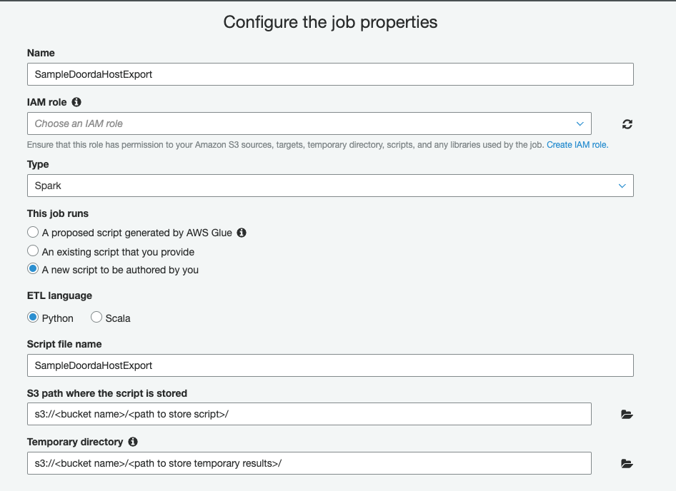
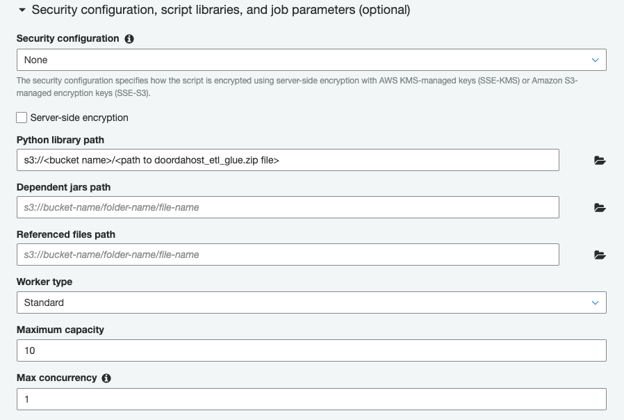
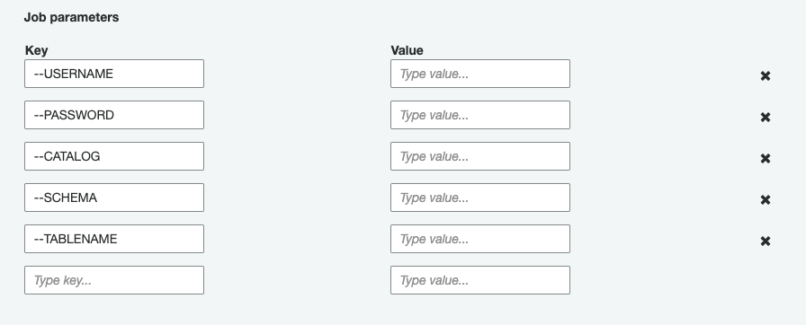

# Example ETL Script (AWS Glue Job)

Example Glue Script to extract table from DoordaHost into Parquet format on s3.


## Requirements

- doorda_sdk>=1.0.7
- requests>=2.21.0
- pyspark==2.2.1  # Current version installed on AWS Glue job

### Usage

1) Make sure that you're in `examples/glue` directory

2) To create a zip folder of all the package requirements, run:

```bash
$ ./build.sh
```

3) Copy `doordahost_etl_glue.zip` into your s3 bucket

4) Click on `Add job` in AWS Glue

    **Parameters**
    - `Name`: {Provide name for job}
    - `IAM role`: {Select iam role}
        - PUT/GET/DELETE object from bucket
    - `Type`: Spark
    - `This job runs`: A new script to be authored by you
    - `ETL language`: Python
    - `S3 path where the script is stored`: {provide path to store authored script}
    - `Temporary directory`: {provide path to store temporary results}


    


    - `Python library path`: {provide path that `doordahost_etl_glue.zip` was uploaded to}
    - `Maximum capacity`: {Adjust depending on needs}
    - `Max concurrency`: {Adjust depending on needs}

    


    - `Job parameters`:

    | key  | value |
    |---|---|
    |  --USERNAME |  username |
    | --PASSWORD  | password  |
    | --CATALOG  |  catalog_name |
    |  --SCHEMA | schema_name  |
    | --TABLENAME  | table_name  |
    | --FILE_OUTPUT_DIRECTORY  | `s3://<bucket>/<path to store parquet files>/`  |

    **NOTE**: This method of passing account information/credentials is useful for testing,
    but will be expose to anyone with access to this job. It is recommended to
    use AWS Systems Manager (Parameter Store) to store and retrieve these details instead.

    


5) Copy `sample_glue_script.py` into Script Editor and amend as needed.
