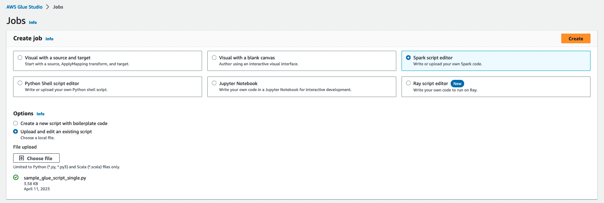
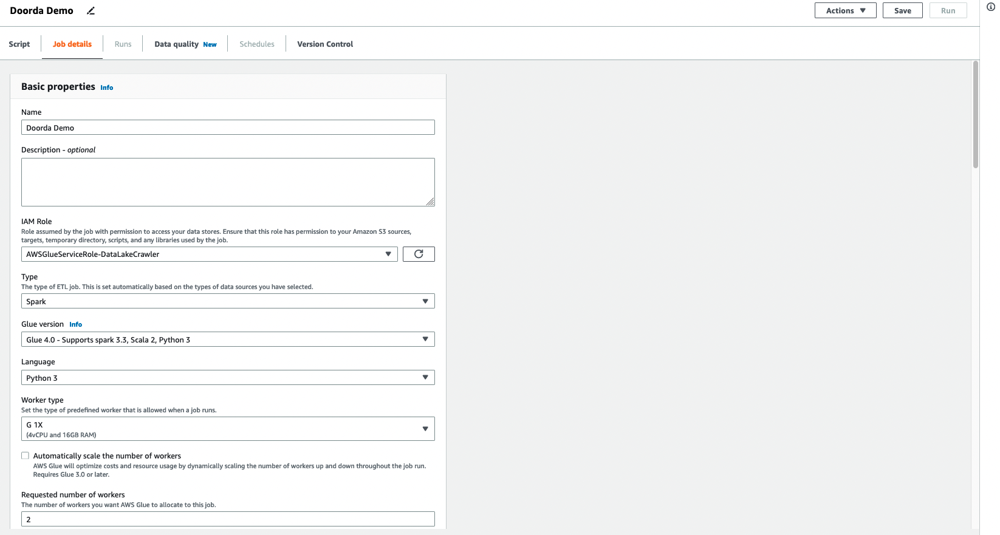
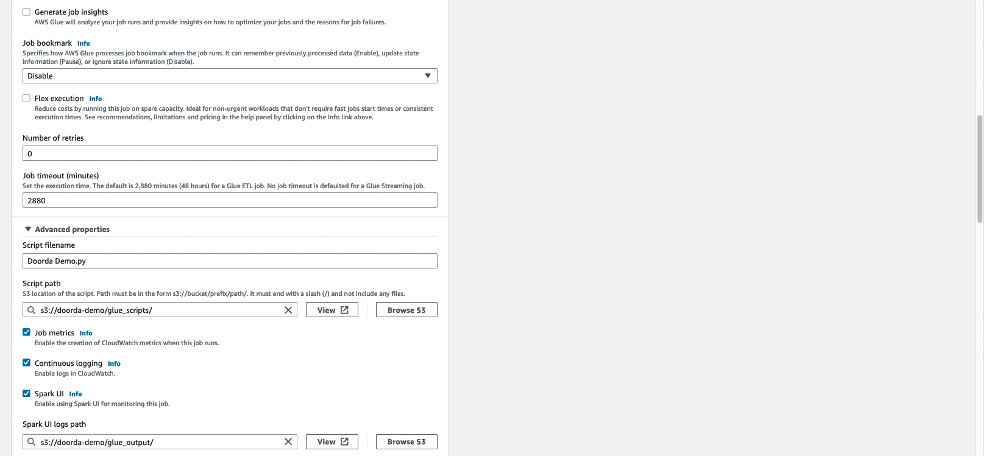
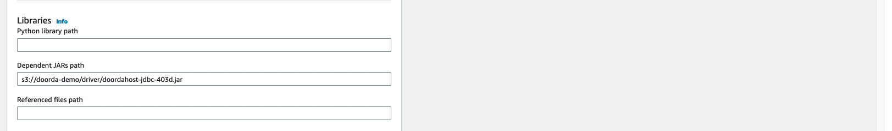
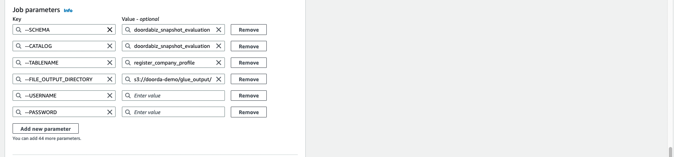

# Example ETL Script (AWS Glue Job)

Example Glue Script to extract data from DoordaHost into Parquet format on s3.  

1) `sample_glue_script_all.py`  
    Extracts all tables from indicated Catalog into S3  
    
2) `sample_glue_script_single.py`   
    Extracts table indicated in `TABLENAME` parameter into S3  

## Requirements

- pyspark==3.3  # Current version installed on AWS Glue job  
- DoordaHost JDBC driver [here](https://github.com/Doorda/drivers-cli/releases/download/403d/doordahost-jdbc-403d.jar)
  
### Usage

1) Click on `Spark script editor` in AWS Glue and upload 1 of the sample scripts. Then click on `Create`.
    

2) Click on `Job details` tab.

    **Parameters**
    - `Name`: {Provide name for job}
    - `IAM role`: {Select iam role}
        - PUT/GET/DELETE object from bucket
    - `Type`: Spark  
    - `Glue version`: Glue 4.0 - Supports spark 3.3, Scala 2, Python 3
    - `Language`: Python 3
    - `Script Path`: {provide path to store authored script}
    - `Temporary Path`: {provide path to store temporary results}
    - `Dependent jars path`: {provide path to bucket on S3 with DoordaHost JDBC driver file (for example, s3://bucket/doordahost-jdbc-403d.jar)}
    - `Requested number of workers`: {Adjust depending on needs}
    
    
    

    - `Job parameters`:

    | key  | value                                        |
    |----------------------------------------------|---|
    |  --USERNAME | username                                     |
    | --PASSWORD  | password                                     |
    | --CATALOG  | catalog_name                                 |
    |  --SCHEMA | schema_name                                  |
    | --TABLENAME  | table_name                                   |
    | --FILE_OUTPUT_DIRECTORY  | `s3://<bucket>/<path to store parquet files>/` |

    **NOTE**: This method of passing account information/credentials is useful for testing,
    but will be expose to anyone with access to this job. It is recommended to
    use AWS Systems Manager (Parameter Store) to store and retrieve these details instead.

    

3) Click on `Save` and `Run` to start job